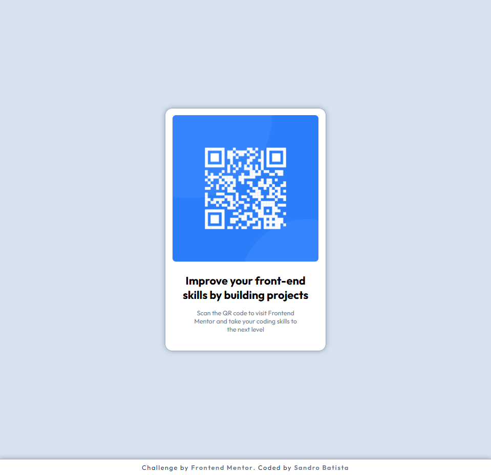

# Frontend Mentor - QR code component solution

This is a solution to the [QR code component challenge on Frontend Mentor](https://www.frontendmentor.io/challenges/qr-code-component-iux_sIO_H). Frontend Mentor challenges help you improve your coding skills by building realistic projects.

## 📌 Overview

### 👀 Screenshot

### 🔗 Links

- Solution URL: [Solution here]()
- Live Site URL: [Live Site Here](https://devsandrobatista.github.io/qr-code-component/)

## 🛠️ My process

### Built with

- Semantic HTML5 markup
- CSS custom properties
- Flexbox
- Mobile-first workflow

### What I learned

- How to center elements with CSS
- How to handle fixed and responsive image sizes
- Controlling spacing and typography according to a design layout

## 🧑🏾‍💻 Author

- GitHub - [@devsandrobatista](https://github.com/devsandrobatista)
- Frontend Mentor - [devsandro](https://www.frontendmentor.io/profile/devsandrobatista)

## 🫱🏾‍🫲🏼Acknowledgments

[Bernardo Poggioni](https://www.frontendmentor.io/profile/Bernardopog)
