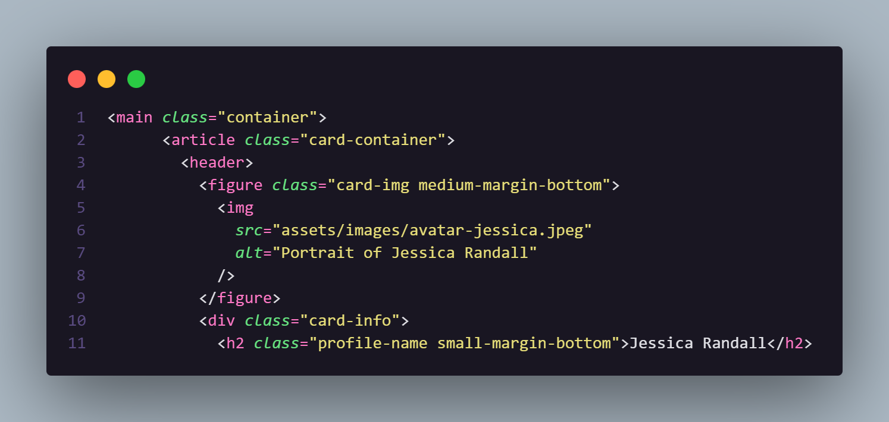
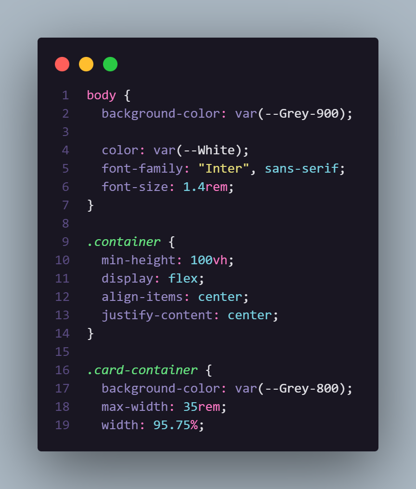

# Frontend Mentor - Social links profile solution

This is a solution to the [Social links profile challenge on Frontend Mentor](https://www.frontendmentor.io/challenges/social-links-profile-UG32l9m6dQ). Frontend Mentor challenges help you improve your coding skills by building realistic projects.

## Table of contents

- [Overview](#overview)
  - [Preview](#preview)
    - [Preview Site](#site)
    - [Preview HTML Code](#html-code)
    - [Preview CSS Code](#css-code)
  - [Links](#links)
- [My process](#my-process)
  - [Built with](#built-with)
  - [What I learned](#what-i-learned)
- [Author](#author)

## Overview

### Preview

#### Site

#### HTML Code

#### CSS Code

**⚠️ Clique na imagem para acessar diretamente o código do projeto.**

### Links

- Solution URL: [Solution here](https://github.com/devsandrobatista/frontend-mentor/tree/main/desafios/perfil-links-sociais)
- Live Site URL: [Live Site Here](https://devsandrobatista.github.io/frontend-mentor/desafios/blog-preview-card/index.html)

## My process

### Built with

- Semantic HTML5 markup
- CSS custom properties
- Flexbox
- Mobile-first workflow

### What I learned

- How to center elements with CSSx
- How to handle fixed and responsive image sizes
- Controlling spacing and typography according to a design layout

## Author

- GitHub - [@devsandrobatista](https://github.com/devsandrobatista)
- Frontend Mentor - [devsandro](https://www.frontendmentor.io/profile/devsandrobatista)
